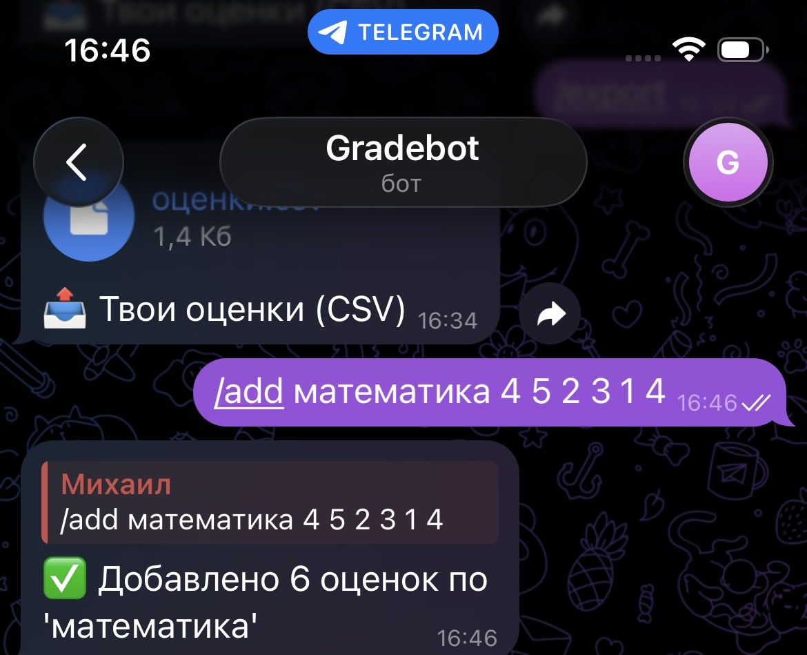
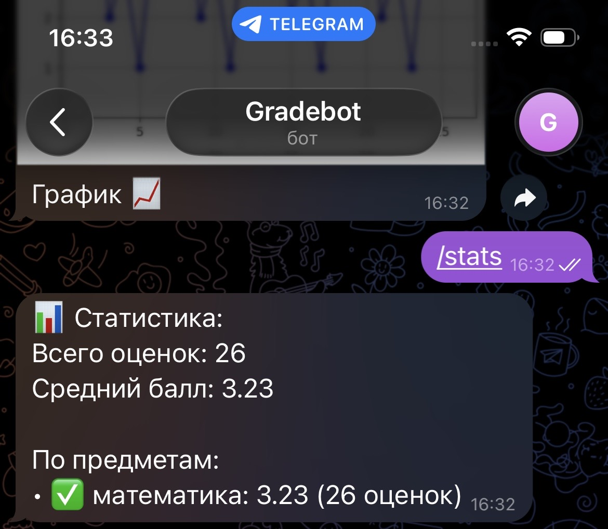
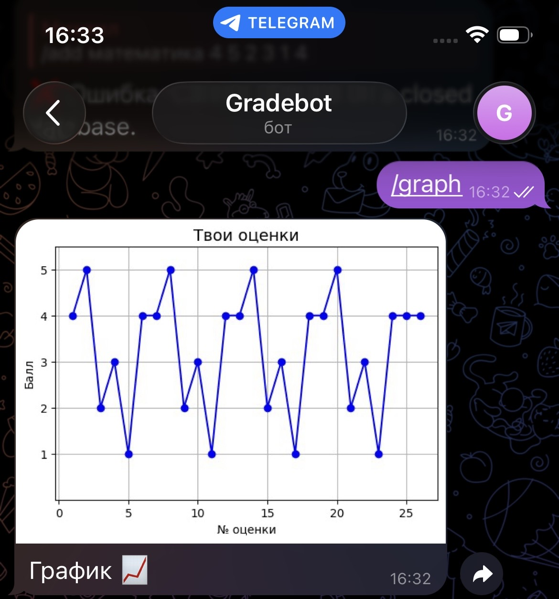
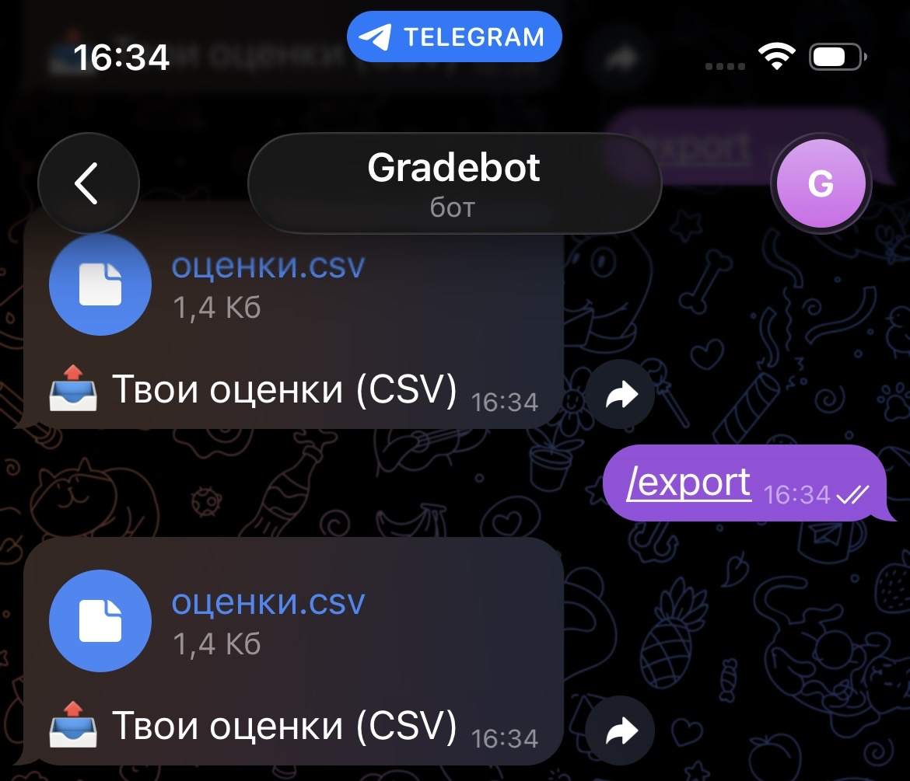
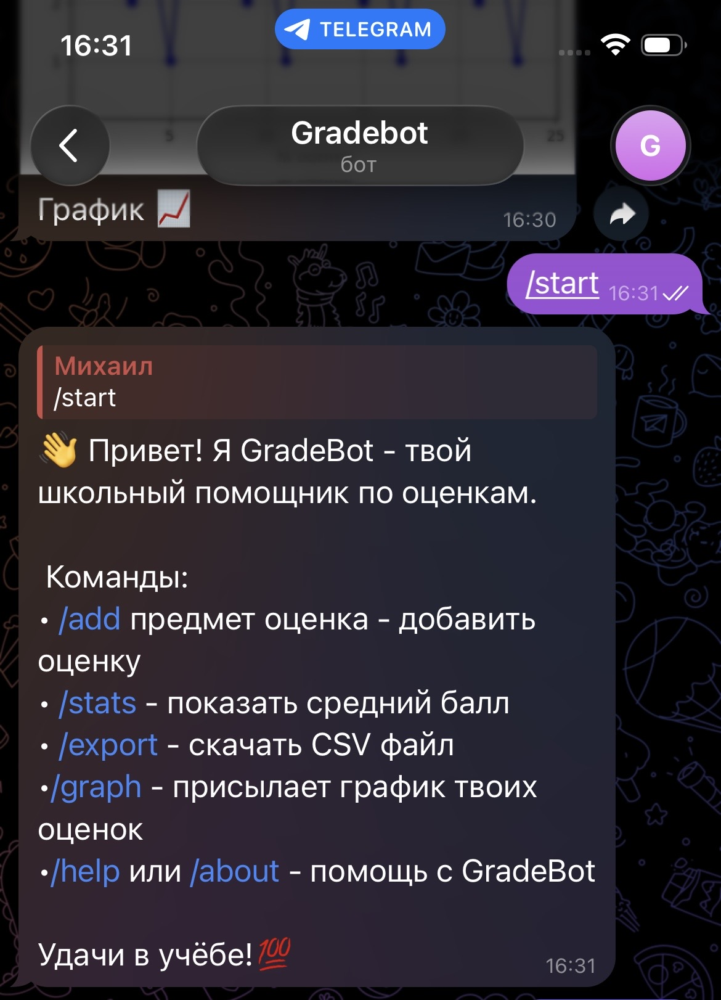
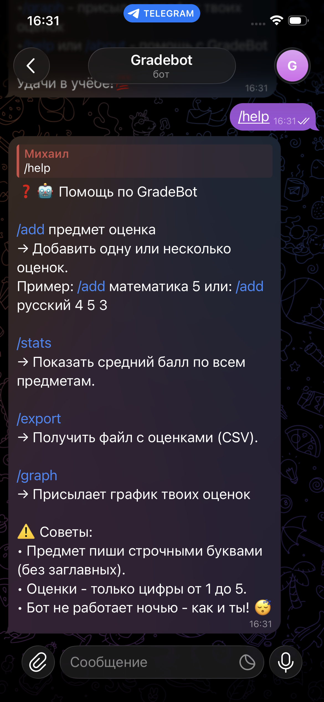
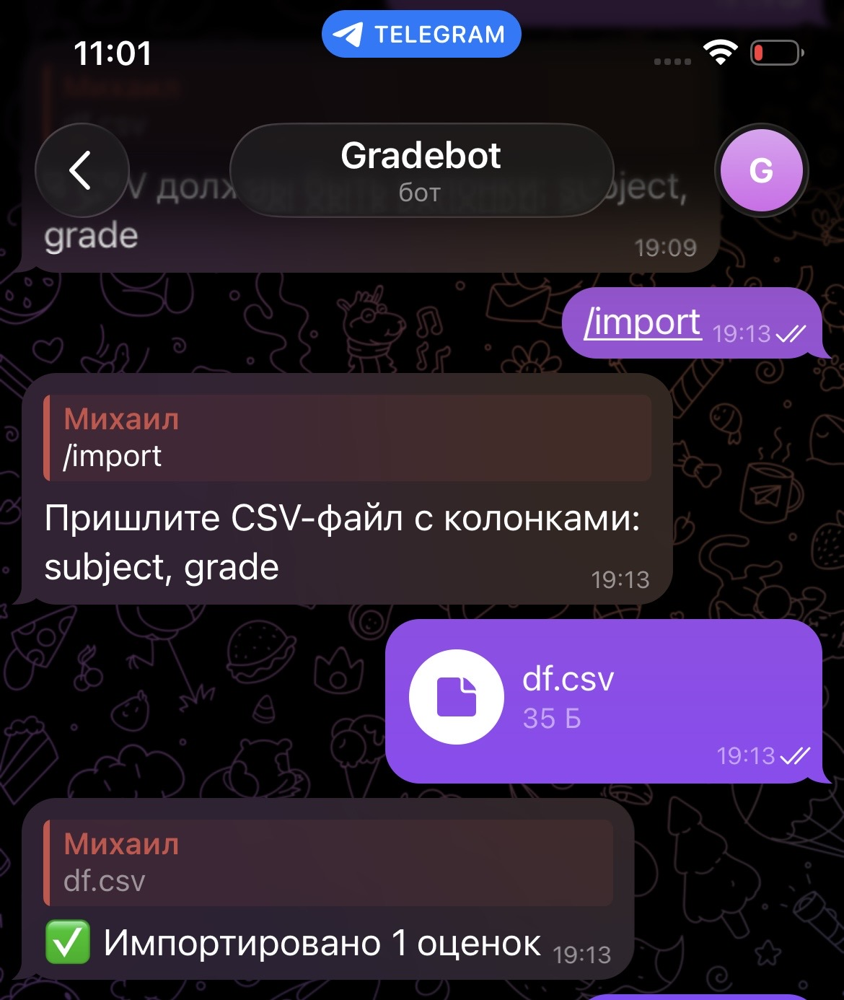

# 📊 GradeBot 4.0

**Telegram bot for tracking grades, weather insights, and study reminders**

A personal pet project developed to help students track their academic performance, analyze grade trends, and get weather-based study insights.

---

## ✨ Features

| Feature | Description |
|---------|-------------|
| 📚 **Grade Tracking** | Add, view, and manage grades by subject |
| 📈 **Statistics** | Average score, progress charts, subject analysis |
| 🌤 **Weather Integration** | Get weather for your city + analyze how it affects your grades |
| 🔔 **Reminders** | Set study reminders with scheduled notifications |
| 📄 **PDF Reports** | Generate beautiful English reports with charts |
| 💾 **Backup & Export** | Database backups and CSV export |
| ⚡ **Weather Caching** | 1-hour cache to reduce API calls |
| 📝 **Logging** | Professional logging system for debugging |
| 👥 **Multi-user** | Each user has their own isolated data |

---

## 🚀 Quick Start

### Prerequisites

- Python 3.8+
- Telegram Bot Token (from [@BotFather](https://t.me/BotFather))
- OpenWeather API Key (from [openweathermap.org](https://openweathermap.org))

### Installation

1. **Clone the repository**
```bash
git clone https://github.com/Mishel067/grade-bot4.0.git
cd GradeBot
```

2. **Install dependencies**
```bash
pip install -r requirements.txt
```

3. **Set up environment variables**
```bash
# Create .env file
TELEGRAM_BOT_TOKEN=your_bot_token_here
OPENWEATHER_API_KEY=your_api_key_here
```

4. **Run the bot**
```bash
python gradebot4.0.py
```

---

## 📋 Commands

| Command | Description |
|---------|-------------|
| `/start` | Welcome message |
| `/help` | Show all commands |
| `/add` | Add a new grade |
| `/graph` | See a graph |
| `/stats` | Show statistics |
| `/weather` | Set your city |
| `/weather_now` | Get current weather |
| `/insight` | Weather + grades analysis |
| `/remind` | Create a reminder |
| `/reminders` | View all reminders |
| `/pdf` | Generate PDF report |
| `/backup` | Download database backup |
| `/export` | Export grades to CSV |
| `/today` | Show today's grades |
| `/delete` | Delete a grade |
| `/clearreminds` | Clear reminds |

---

## 🛠️ Technologies

| Technology | Purpose |
|------------|---------|
| **Python 3.8+** | Main language |
| **pyTelegramBotAPI** | Telegram bot framework |
| **SQLite** | Database |
| **pandas** | Data analysis |
| **matplotlib** | Charts and graphs |
| **reportlab** | PDF generation |
| **requests** | API calls |
| **APScheduler** | Scheduled tasks |
| **logging** | Professional logging |

---

## 📁 Project Structure

```
GradeBot/
├── gradebot4.0.py # Main bot code
├── requirements.txt # Dependencies
├── README.md # This file
├── .env # Environment variables (do not commit!)
├── .gitignore # Git ignore rules
├── backups/ # Database backups
├── gradebot.log # Log file
└── grades.db # SQLite database
```

---

## 📊 Sample Output









---

## 🔐 Security

- **Never commit** `.env` file with your tokens
- **Never commit** `grades.db` with user data
- Use `.gitignore` to exclude sensitive files

---

## 👨‍💻 Author

**Mikhail** - *Student & Developer*

- Telegram: [@a_b_c6f4](https://t.me/a_b_c6_f4)
- GitHub: [Mishel067](https://github.com/Mishel067)

---

## 📈 Progress

| Version | Date |
|---------|------|
| 1.0 | Feb 2026 | 
| 2.0 | Feb 2026 |
| 3.0 | Mar 2026 |
| **4.0** | **Mar 2026** |
---

<div align="center">

**Made with ❤️ and lots of ☕**

⭐ Star this repo if you like it!

</div>
```
